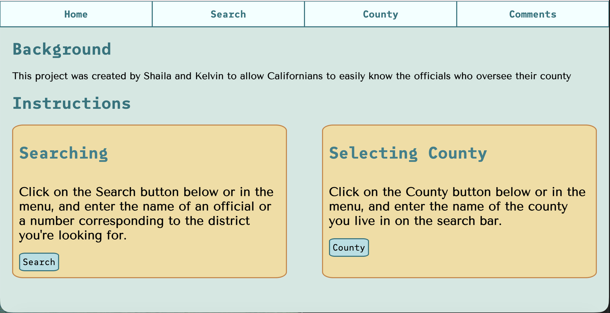
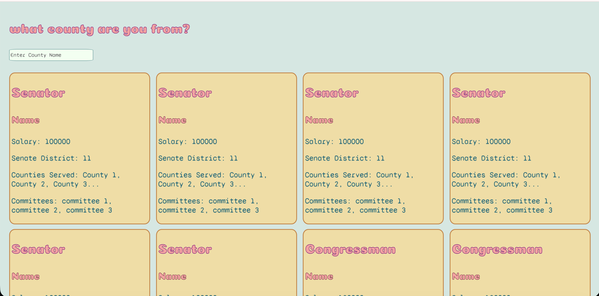
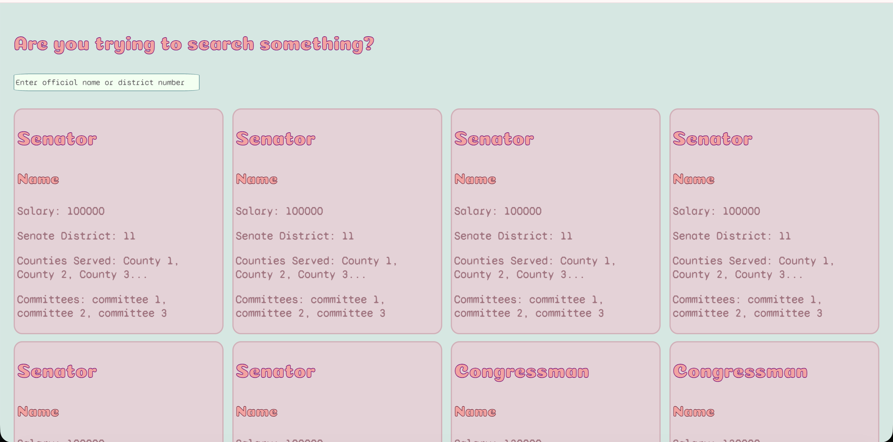
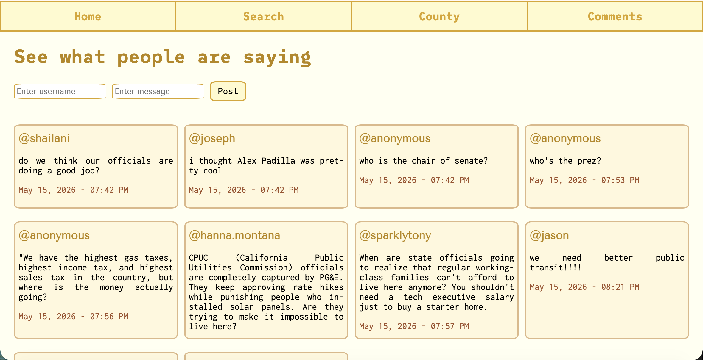

# CalOfficials
## Authors
Shaila Lewis and Kelvin Myat

## Description
This application is meant to allow users in California to easily find out who their elected officials and representatives are.

# Project Structure
The workspace contains:
- `calofficials/src`: folder to mantain sources
    - `main`:
        - `java`: folder to mantain classes and entrypoints organized.
        -  `resources`: folder to mantain visuals and web templates organized.
- `data`: folder to mantain csvs containing initial data for our government information.
- `doc`: folder mantaining documentation (UML Diagram, Website preview, etc.)       

## Classes (UML Diagram)

## Website Mockup

# Instructions
Run CalOfficialsApplication.java in the shai/kelv/calofficials folder, then enter localhost:8080 in your browser to access the website. Follow the instructions in the website after that.

(BEWARE: Website is still under construction so all data is static)

