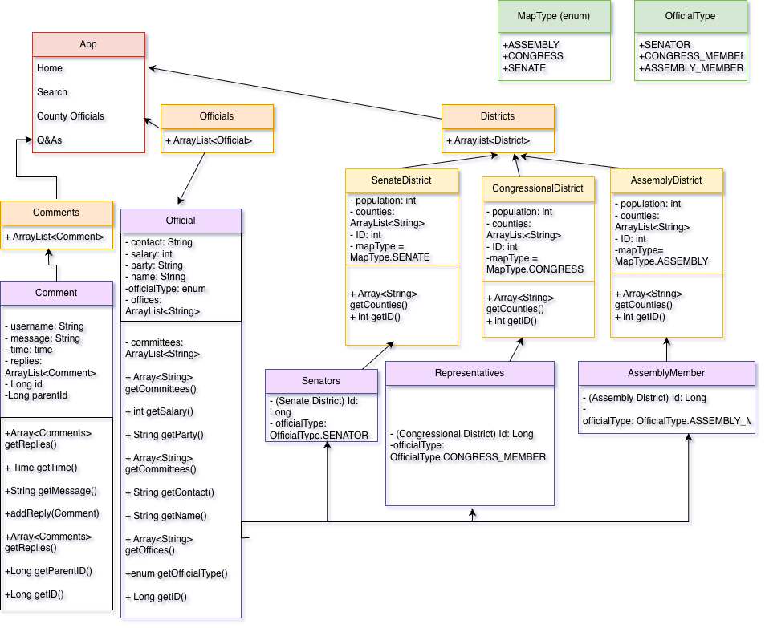

# CalOfficials
## Authors
Shaila Lewis and Kelvin Myat

## Description
This application is meant to allow users in California to easily find out who their elected officials and representatives are.

# Project Structure
The workspace contains:
- `src`: folder to mantain sources
    - `main`:
        - `java`: folder to mantain classes and entrypoints organized.
        -  `resources`: folder to mantain visuals and web templates organized.
- `doc`: folder mantaining documentation        

## Classes (UML Diagram)

## Website

# Instructions

